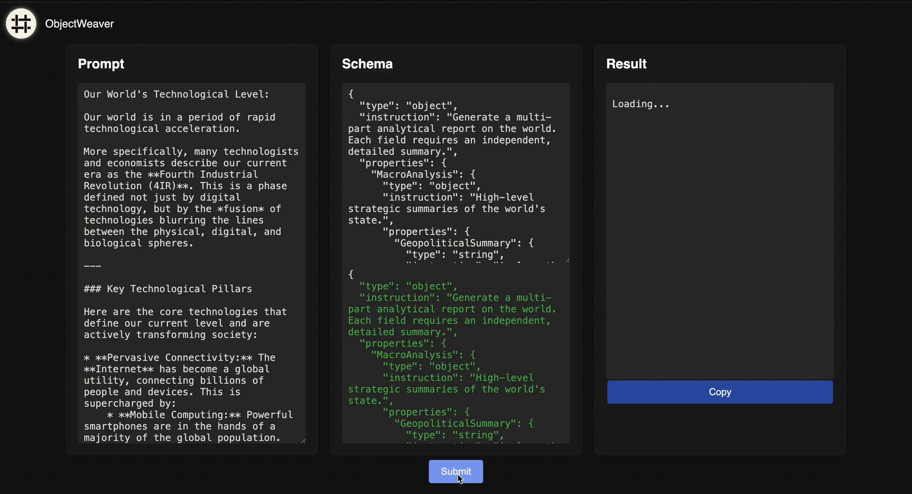

<div align="center">

# <span style="font-family: 'Roboto', sans-serif;">ObjectWeaver</span>

[](https://github.com/objectweaver/objectweaver/blob/main/LICENSE.txt)
[](https://hub.docker.com/r/objectweaver/objectweaver)
[](https://objectweaver.dev/docs)
[](https://github.com/ObjectWeaver/ObjectWeaver/actions/workflows/codeleft-test.yaml)

</div>

ObjectWeaver is the schema-first LLM orchestration engine that turns chaos into structure. It allows you to define your data model, route to the best models, and get guaranteed JSON back every time. By decomposing schemas into field-level tasks and processing them in parallel, ObjectWeaver ensures 100% valid output, reduces costs through model specialization, and improves performance.

For complete documentation, examples, and guides, visit [our documentation](https://objectweaver.dev/docs).

<div align="center">
  
</div>

## Why ObjectWeaver?

Traditional JSON generation with LLMs often fails, with success rates as low as [35-65%](https://composio.dev/blog/gpt-4-function-calling-example). While grammar-constrained alternatives can guarantee syntax, they force a one-size-fits-all approach, using a single model and prompt for all fields. ObjectWeaver solves this by providing intelligent, field-level orchestration that offers several key advantages:

-  **Guaranteed JSON Output**: Field-level type validation and compositional assembly ensure 100% valid JSON every time.
-  **Parallel Generation**: Independent fields are generated concurrently, leading to significantly faster processing times.
-  **Model Specialization**: Route simple tasks to efficient models and complex reasoning to more powerful ones, reducing costs by 10-20x.
-  **Break Context Limits**: Generate massive datasets and comprehensive documents that exceed the context window of a single model.
-  **Composable Intelligence**: Move beyond simple prompts by treating your schema as a system of composable agents. Chain fields together to fetch data, make decisions, and pass context, allowing you to build complex applications with the simplicity of a JSON definition.

## Getting Started

The easiest way to get ObjectWeaver running is with Docker.

1.  **Pull the Docker image:**

    ```bash
    docker pull objectweaver/objectweaver:latest
    ```

2.  **Run the Docker container:**

    ```bash
    docker run -p 2008:2008 \
      -e PASSWORD=your-request-api-key \
      -e OPENAI_API_KEY=your-openai-key \
      objectweaver/objectweaver:latest
    ```

    - `PASSWORD`: Your chosen API key for securing the ObjectWeaver service.
    - `OPENAI_API_KEY`: Your OpenAI API key. ObjectWeaver can also be configured to use other providers like Gemini or a local model.

That's it! The server will be running on `localhost:2008`.

## Making Your First Request

Here’s how to make a basic API call to generate a structured JSON object. The `definition` field uses standard JSON Schema syntax to specify the desired output structure.

### cURL

```bash
curl -X POST http://localhost:2008/api/objectGen \
  -H "Authorization: Bearer your-api-token" \
  -H "Content-Type: application/json" \
  -d '{
        "prompt": "Generate a schema that defines the technological landscape of the world",
        "definition": {
          "type": "object",
          "instruction": "Defines the technological landscape of the world, including its level of advancement and notable innovations.",
          "properties": {
            "Level": {
              "type": "string",
              "instruction": "Categorize the overall technological sophistication of the world, such as medieval, industrial, or advanced futuristic."
            },
            "Inventions": {
              "type": "string",
              "instruction": "Describe the most significant technological discoveries and their transformative impact on the society, economy, and daily life."
            }
          }
        }
      }
'
```

Find more different language examples [here](https://objectweaver.dev/docs/api-reference/curl-examples).

## Features

ObjectWeaver is designed for production use and includes several powerful features to handle real-world complexity:

-    **Batch Processing & Priority System**: Optimize costs by up to 50% by routing non-urgent requests to OpenAI's Batch API. You can assign priorities to different fields to balance speed and cost.
-    **Decision Points**: Embed adaptive intelligence in your schemas to dynamically alter the generation process based on the output of other fields.
-    **Streaming Requests**: Stream data as it's generated for real-time applications.
-    **Epistemic Validation**: Implement validation and retry logic to ensure the quality and accuracy of the generated data.
-    **Data Fetching**: Fetch data from external sources and use it as context for generation.

## Configuration

Configure the service using environment variables. Here are some of the main options:

```bash
# Required for API access
PASSWORD=your-secure-api-token
# Your LLM provider key
OPENAI_API_KEY=your-openai-api-key

# LLM provider settings
LLM_PROVIDER=openai                      # openai, gemini, or local
LLM_API_URL=https://api.openai.com/v1
LLM_MAX_TOKENS_PER_MINUTE=150000
LLM_MAX_REQUESTS_PER_MINUTE=500

# Server settings
PORT=2008
ENVIRONMENT=production
```

For a full list of configuration options and what they do, check out the [configuration guide](https://objectweaver.dev/docs/getting-started/docker-setup).

## Building from Source

If you prefer to build ObjectWeaver yourself:

```bash
git clone https://github.com/objectweaver/objectweaver.git
cd objectweaver
go build -o objectweaver .
./objectweaver
```

You're also able to find the compiled binaries in the [releases](https://github.com/ObjectWeaver/ObjectWeaver/releases).

## Community and Support

-    **Star on GitHub**: If you find ObjectWeaver useful, please [give us a star on GitHub](https://github.com/objectweaver/objectweaver)! It helps others discover the project.
-   **Documentation**: For detailed guides, examples, and API references, visit our [documentation website](https://objectweaver.dev/docs).
-   **GitHub Issues**: If you encounter a bug or have a feature request, please [open an issue on GitHub](https://github.com/objectweaver/objectweaver/issues).
-   **Contact Us**: For enterprise inquiries, please [contact us](https://objectweaver.dev/enterprise).

## Contributing

Contributions are welcome! Please see our [CONTRIBUTING guide](https://github.com/ObjectWeaver/ObjectWeaver/blob/main/CONTRIBUTING.MD) for guidelines on how to contribute to the project.

## License

ObjectWeaver uses a **dual licensing model**:

### Community Edition (AGPL-3)

The ObjectWeaver Community Edition is available under the GNU Affero General Public License v3. It is free for internal tools, development, and open-source projects. There are no restrictions on self-hosted deployments within your organization. However, if you offer it as a network service to third parties (e.g. SaaS), you must make your modified source code available under the same license.

### Commercial License

Building a SaaS product or proprietary service? The Commercial License removes open-source obligations and includes enterprise-grade support, legal protection, and compliance assistance. The code in the `ee/` directory is licensed under this commercial license.

For commercial licensing inquiries, visit [our enterprise page](https://objectweaver.dev/enterprise) or contact enterprise@objectweaver.dev. 